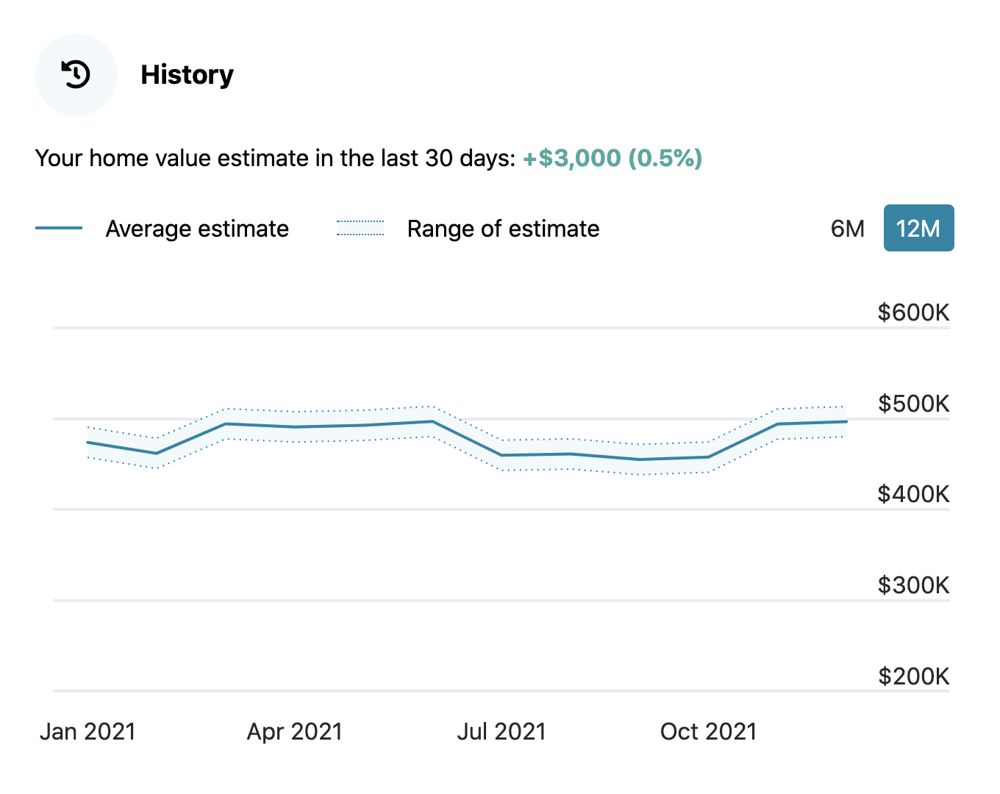
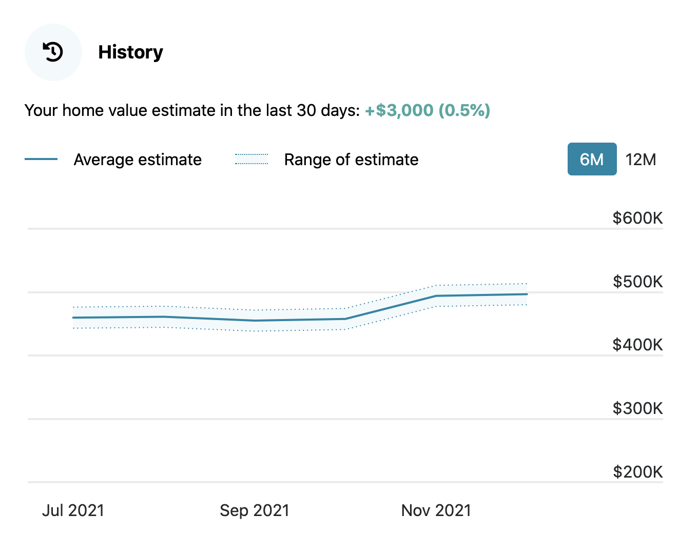
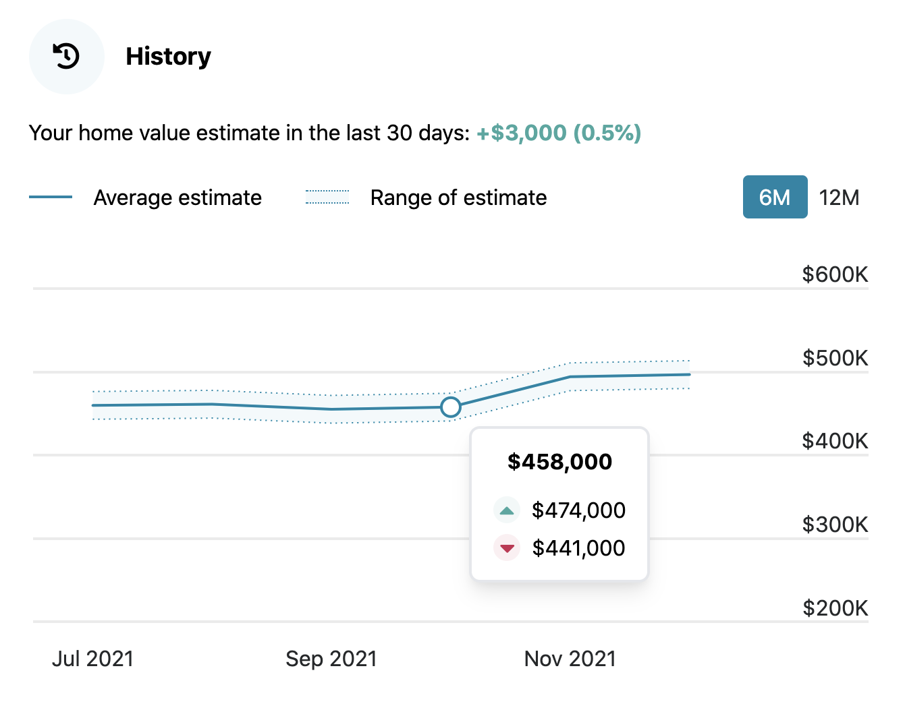
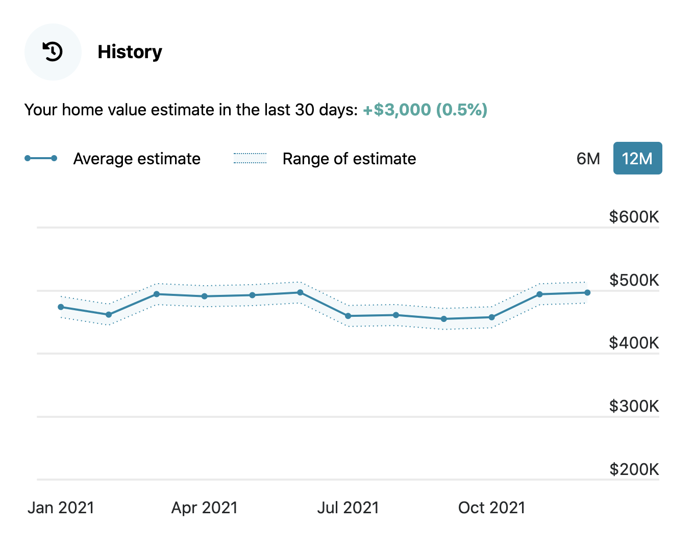
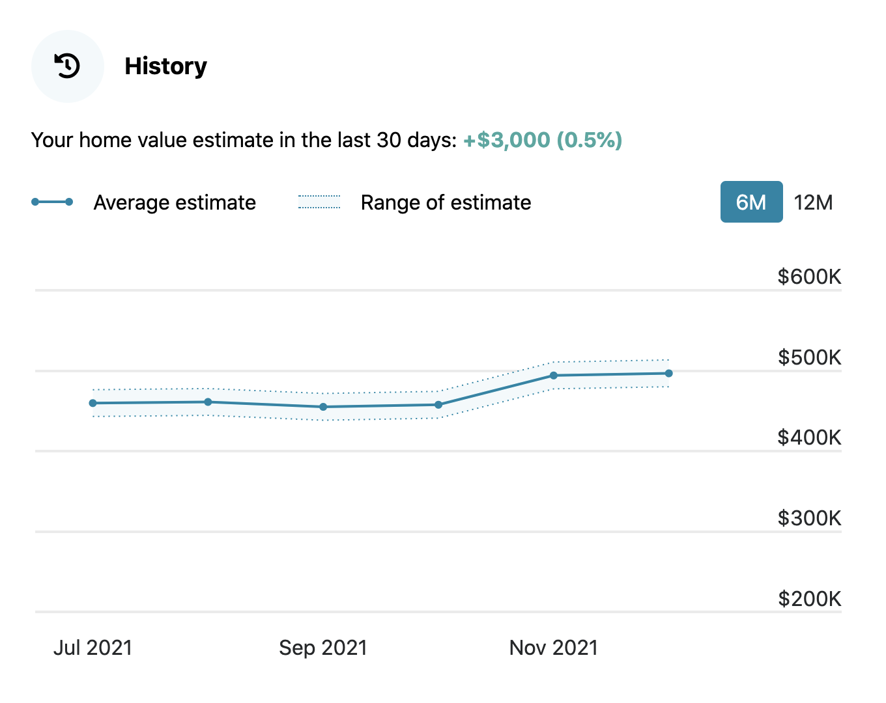
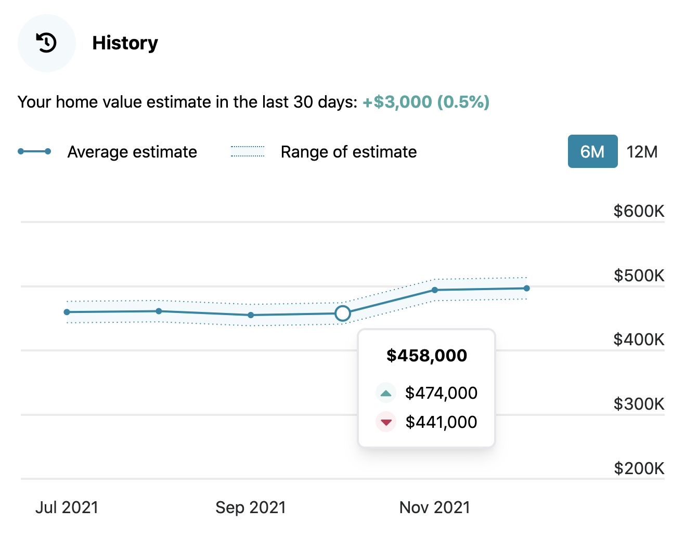

# Home Valuation Chart

Custom chart with [Chart.js](https://www.chartjs.org/)

## Without point radius:

12M view

6M view

Custom tooltip

## With point radius (may be better for touch devices):

12M view

6M view

Custom tooltip

# How to run locally

- Install npm packages

  - `npm install`

- Use parcel-bundler to watch for frontend changes

  - `npm run watch`

- Use nodemon to watch for backend changes
  - `npm run startDev`

# TODO

- Gridlines and ticks seem to be dependent on each other (can't have one without the other). Figure out how to add ticks to X axis, but not gridlines.
- When hovering over a data point, show the gridline for that single data point. [See spec for example](https://guaranteedrate.invisionapp.com/console/share/H8294RL6R3/516032380). This may not be necessary if using the chart with point radii.
- If using the chart without point radii, figure out how to add radii to only the ends of the "Average estimate" line, per spec.

# Questions

- In case data fetch fails, what needs to be rendered? Placeholder image?
- If "home value estimate" line is negative, should it still be rendered? If so, should it be a different color?
- What is the minimum number of datasets needed to render the chart and still look good? 2 points? More?
- Do we need to incorporate different currencies?
